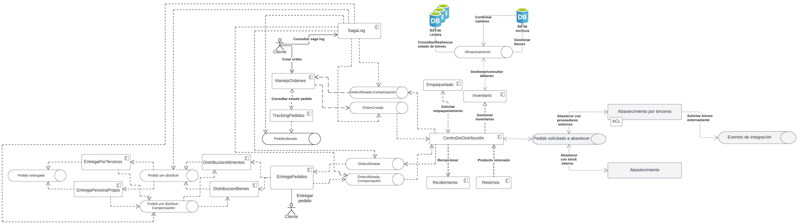

# Not-monolithic-experiments
Entrega 4 y 5 para la materia de diseño y construcción de aplicaciones no monolíticas

# Utilizar en despliegue cloud

## Plataforma de despliegue
- Utilizamos un cluster de kubernetes en GCP y una base de datos manejada de MySQL en GCP
- Para el broker de eventos de pulsar utilizamos un cluster manejado en streamnative.com


Endpoints:
- BFF: http://34.75.144.91/v1
- Sagalog: http://34.23.53.24/transactions


# Operaciones de ejecucion
## Coleccion postman
La coleccion se encuentra ```postman/NoMonolitos.postman_collection.json```

## Como ejecutar una mutacion al BFF?
El BFF expone GraphQL y tiene una interfaz grafica en la url o puede ejecutar la coleccion de postman:
- http://34.75.144.91/v1

Desde alli puede ejecutar la siguiente mutacion
```
mutation {
  crearOrden(idUsuario: "123", simError: "", items: [
    {
      direccionRecogida: "Direccion recogida 123",
      direccionEntrega: "Direccion entrega 123",
      tamanio: "5kg",
      telefono: "3210003212"
    }
  ])
  {
    mensaje
    codigo
  }
}
```

Puede cambiar los parametros de idUsuario, agregar o quitar los items que desee cambiando los respectivos paramétros, lo más importante de esa petición es el **simError**, este es el parámetro que permite simular un error en alguno de los servicios y por ende generar eventos de compensación para revertir la orden.

Los valores de simError son: ordenes, centrodistribucion y entregas que son los respectivos microservicios, si desea que la transacción sea exitosa reemplace por una string vacía

## Como consultar el saga log?
El saga log expone un endpoint en la siguiente url:
- Sagalog: ```GET http://34.23.53.24/transactions```
- Sagalog de una transaccion en especifica: ```GET http://34.23.53.24/transactions/<order_guid>```

En el primer endpoint vemos todas los eventos que se han escuchado mientras que en el segundo obtenemos el sagalog de una transaccion especifica

# Ejecución en Maquina local 

## Requisitos
- Docker
- docker-compose
- Python y un ambiente basado en Linux (la libreria pulsar-client[avro] solo esta disponible para sistema macOs y Linux) - Puede utilizar WSL en windows que es el mecanismo que usamos o gitpod
- Instalar las dependencias de python que estan en el archivo requirements.txt, para esto puede crear un ambiente virtual de python nuevo
## Levantar Broker de mensajería
Desde el directorio principal ejecute el siguiente comando.

```bash
docker-compose --profile pulsar up
```

Este comando descarga las imagenes y levanta el broker de eventos pulsar
## Levantar bases de datos
Desde el directorio principal ejecute el siguiente comando.

```bash
docker-compose --profile db up
```

Este comando descarga las imágenes e instala las dependencias de la base datos.
Este va a crear el servidor de base de datos con las bases de datos independientes para cada microservicio

## Microservicio de Ordenes 
Desde el directorio principal ejecute el siguiente comando.
``` bash
flask --app src/ordenes/api run --port=5000
```

Esto va a ejecutar el microservicio de Ordenes
## Microservicio de Centro de distribucion
Desde el directorio principal ejecute el siguiente comando.
``` bash
flask --app src/centrodistribucion/api run --port=5001
```
Esto va a ejecutar el microservicio de Centro de distribucion
## Microservicio de Entregas 

Desde el directorio principal ejecute el siguiente comando.
``` bash
flask --app src/entregas/api run --port=5002
```
Esto va a ejecutar el microservicio de Entregas

## Envio comando de creacion de orden
Desde el directorio principal ejecute el siguiente comando.
``` bash
python src/test-eventos/envio-crearorden.py
```

## BFF: Web

Desde el directorio `src` ejecute el siguiente comando
```bash
uvicorn bff_web.main:app --host localhost --port 8003 --reload
```

### Crear imagen Docker

Desde el directorio principal ejecute el siguiente comando.

```bash
docker build . -f bff.Dockerfile -t ordenes/bff
```

### Ejecutar contenedora (sin compose)

Desde el directorio principal ejecute el siguiente comando.

```bash
docker run ordenes/bff
```

## Sagalog:

Desde el directorio `src` ejecute el siguiente comando
```bash
uvicorn sagalog.main:app --host localhost --port 8004 --reload
```

### Crear imagen Docker

Desde el directorio principal ejecute el siguiente comando.

```bash
docker build . -f sagalog.Dockerfile -t ordenes/sagalog
```

### Ejecutar contenedora (sin compose)

Desde el directorio principal ejecute el siguiente comando.

```bash
docker run ordenes/sagalog
```

Esto va a publicar un comando en el topico de comandos de eventos con la informacion necesario para crear un evento de alli se realiza la coreografia en una transaccion larga pasando por cada microservicio para entregar la orden

## Overview diagrama arquitectura


Se usa un patrón de Sagas utilizando Coreografía, donde el fundamento de la coreografía es que cada quién sabe cómo coordinarse por lo tal el saga log es un observador del estado de la transacción aunque puede tomar parte activa en situaciones donde la coreografía no vaya en buen camino, de esta manera logramos que en la transacción larga consigamos atomicidad creando la Orden

# Escenarios de arquitectura
Algunos escenarios fueron modificados debido a que escenarios propuestos en la entrega pasada no reflejaban.

En los escenarios de calidad que definimos para esta experimentación se encuentran los atributos de calidad de mantenibilidad, disponibilidad y escalabilidad, a continuación, veremos los resultados que se obtuvieron en cada escenario de calidad. 

## Conclusiones de la experimentacion 
## Escenario Mantenibilidad - Facilidad de integración
Se espera que el sistema sea capaz de integrarse con cualquier sistema tercero en un tiempo menor o igual a 2 meses, para así, poder brindar servicios de cadena de suministro interactuando con el sistema integrado. 

Como se cumplió: 

La mejor forma de cumplir esto, es con la arquitectura propuesta la cual esta basa en eventos, el microservicio encargado de administrar los centros de distribución el cual está diseñado para recibir eventos de ordenes utilizando un schema Avro completamente versionada, esto junto con la orquestación que se definió para la arquitectura nos ayuda a cumplir con el atributo de mantenibilidad y la facilidad de integración. 

Basados en la experiencia del equipo de desarrollo y en el tiempo que nos tomó desarrollar los experimentos, estimamos que diseñar e implementar nuevos schemas de sistemas externos que se adapten a los eventos que ya se manejan en los microservicios no debería tomar tiempo del definido en el escenario de calidad. 

Para probar esto se crearon varios clientes de prueba para hacer en envió y consumo de los eventos, con los cuales se simularon diferentes sistemas multisource, en la construcción de estos clientes y la integración con la interfaz que se definió no nos tomó más de 8 horas para tener una integración suficiente para hacer las pruebas necesarias.    

## Escenario Disponibilidad - Resiliencia a particiones
Se espera que después que una orden haya sido recibida esta sea procesada el 99.999% de las veces dado que alguno de los microservicios de órdenes, centro de distribución o entregas no esté funcionando 

Cómo se cumplió: 

Como ya lo mencionamos tenemos una arquitectura basada en eventos, lo cual hace que la comunicación entre nuestros microservicios sea totalmente asíncrona y con cumplimos el objetivo de tener desacoplada nuestra solución final. Si en algún momento uno de los microservicios llegase a fallar el broker de mensajería se encargaría que ningún Evento/Comando se pierda, si el evento no se complote por alguna falla del microservicio, estos no serán eliminados y cuando el microservicio se recupere el evento será procesado, con eso no existe la perdida de mensajes entre los microservicios y se procesaran el 99.98% de los mensajes. 

Para probar que la resiliencia esté funcionando como esperamos, se decidió detener el microservicio que se construyó para los centros de distribución, ya que este es el servicio que este en medio del proceso total de la gestión de las ordenes, las ordenes se siguen creando, los eventos se siguen generando y el microservicio de entregas sigue en escucha de los eventos generados por centrodedistribucio, los eventos de crearOrden se siguen creando y agregándose a la cola de mensajería, y cuando el microservicio centrodedistribucio este al aire de nuevo, el flujo de las ordenes continua de forma normal con los eventos crearOrden y los eventos que ya se crearon mientras el microservicios esta deshabilitado, también son atendidos 

## Escenario Escalabilidad - Recibir ordenes
Se espera que el sistema frente a un aumento de transacciones de pedidos de 328.000 pedidos por día en temporada pueda procesar la creación de pedidos en menos de 2 minutos el 99.99% de las veces. 

Como se cumplió: 

La naturaleza de una arquitectura orientada a ventos hace que un atributo de calidad como la escalabilidad sea inherente a la construcción de la misma, para sumar a este atributo de calidad y cumplir con el requerimiento de calidad propuesto, se decidió implementar un patrón de orquestación para el manejo y orden de los eventos que comunican a los diferentes microservicios. Al tener un servicio central que se encarga del manejo de los eventos, es más fácil escalar los recursos necesarios para satisfacer el aumento de las peticiones que se esperan que se presenten en un determinado momento.

# Almacenamiento
## Topología de administración de datos
Se utiliza una topología híbrida donde cada servicio tiene su propia base de datos independiente que no se comunica entre sí, lo cual puede ser referido como un namespace, pero coexisten en el mismo servidor, esto debido a la facilidad y flexbilidad para mantener y monitorear los cambios en un único servidor de base de datos.

Esto aplica para los 3 microservicios.
## Capa de datos
Se utiliza un modelo CRUD donde se crean los objetos en la base de datos de cada microservicio y de allí se genera un evento que también se persiste en la base de datos y se publica al tópico de eventos correspondiente, pero el tópico no es persistente y no generamos proyecciones para generar el estado de la base de datos que contiene el estado de la orden.

Esto aplica para los 3 microservicios.

# Mapa de contexto As-To-Be modificado
Teniendo en cuenta los comentarios del tutor en las entregas y adaptandolo a una comunicación orientada a los eventos, en base a los experimentos, el mapa de contexto resultante es el siguiente:


Entre los cambios que se tiene son:
* Se elimina el dominio Ordenes y el mapa de contexto PlanificacionOrden ahora pertenece al dominio de Logística. Este mapa de contexto en base a la orden generada elabora un plan para la entrega de productos/bienes. 
* Se agrega contexto de AbastecimientoPorTerceros, que apoya al contexto Abastecimiento en caso no se pueda abastecer con las existencias de la compañia. Esto se hace con el fin de tener contextos separados, uno específico para atender operaciones con bodegas externas y el otro que trabajaría con los otros contextos enfocados en las bodegas internas.
* Se evita el uso de patrón de comunicación Shared Kernel debido a que es un patrón no recomendable para un arquitectura basada en eventos.
* Se agrega contexto de AdministracionUltimaMilla, que en base a los despachos comunicados por DespachoAlimentos o DespachoPedidos (bienes) genera un comando para que EntregaPersonalPropio o EntregaPorTerceros, según convenga, se hagan cargo de entregar lo solicitado en la orden del cliente.


# Diagrama de contexto modificado
Teniendo en cuenta los comentarios del tutor en las entregas y adaptandolo a una comunicación orientada a los eventos, en base a los experimentos, el diagrama de contexto resultante es el siguiente:


Entre los cambios que se tiene son:
* Se trata de un sistema distribuido basado en microservicios entre los dominios de logística y cadena de suministro. Esta arquitectura permitirá la independencia entre los servidores del sistema y resiliencia a posibles fallos entre alguno de ellos. Se afecta la comunicación entre los microservicios pero permite que estos escalen según la demanda.

* Se decide separar las bases de datos a un servidos distinto al del sistema, para así dar la posibilidad de que estas bases de datos puedan escalar sin afectar el rendimiento de los servidores del sistema. Al hacer esto se está asumiendo el reto de que la comunicación con las bd's dependa de la conectividad de red entre los servidores del sistema y la base de datos, aumentando así la latencia en las funcionalidades. Sin embargo el desacoplamiento entre ambos beneficia la independencia entre los servidores.

* Se tiene en cuenta la comunicación asíncrona con servicios externos tanto para bodegas como para entregas. Esto permite que el sistema sea capaz de soportar solicitudes, apoyándose de los servicios que brinden otros proveedores. La desventaja sería que requerirá asegurarse que la comunicación con sistemas externos sea estable y una buena definición de esquema y patrones para que esta interacción funcione.


# Vista funcional modificado
Teniendo en cuenta los comentarios del tutor en las entregas y adaptandolo a una comunicación orientada a los eventos, en base a los experimentos, la vista funcional resultante es la siguiente:


Entre los cambios que se tiene son:
* Se propone tener los módulos de proyecto en base a los dominios. De esta forma, se desacopla la dependencia entre ellos, y sus funcionalidades e instancias que serán especializadas según donde se encuentren. La desventaja de esto es que puede haber confusión entre instancias es que puede haber muchas veces repetición de código en ambos módulos, lo cual atentaría con el patrón DRY, sin embargo, independizará muchas veces cuando en un dominio evolucione una función, mientras que en otra se mantenga.

* Es necesario que los módulos estén comunicados con la orden, ya que esta brindará la información necesaria para verificar la disponibilidad del pedido según Cadena suministro, como planificar y ejecutar la mejor manera para entregar el pedido al cliente.

* En ambos módulos se han definido elementos especializados para las integraciones con terceros (AbastecimientoPorTerceros y EntregaPorTerceros). Esto permitirá que se tenga aislada las lógicas de integración. El tener más elementos especializados para trabajar con terceros deberá ser lo suficientemente resiliente para poder soportar fallas de sistemas terceros sin afectar al propio sistema.


# Diagrama de componentes C&C modificado
Teniendo en cuenta los comentarios del tutor en las entregas y adaptandolo a una comunicación orientada a los eventos, en base a los experimentos, el diagrama de componentes resultante es el siguiente:



Entre los cambios que se tiene son:
* Se utiliza comunicación asíncrona entre todos los componentes para así asegurar la independencia, escalabilidad y disponibilidad entre los componentes, aumentando tambien su resiliencia. No obstante, tener comunicación asíncrona generará cierta latencia en el sistema en general.

* Se aplica el uso de Sagas, el cuál permite al usuario consultar el estado de su pedido a lo largo del flujo desde que su solicitud hasta su entrega.

* Se aplica la comunicación por tópicos de eventos, y ante eventuales fallas, se utilizan tópicos de eventos por compensación. La desventaja de ello es que aumenta la complejidad para probar el flujo completo del sistema.


# Actividades realizadas por cada miembro
Miguel:
* Implementación de microservicio de Entregas utilizando los principios de DDD, con patrones de Comandos y Eventos, eventos de dominio e integración para la comunicación interna dentro del microservicio y externa con el tópico donde se publican los eventos relacionados a que la orden fue entregada, persistencia de los objetos y eventos en la base de datos utilizando CRUD en un mecanismo de unidad de trabajo.

Andres:
* Implementación de microservicio de Ordenes utilizando los principios de DDD, con patrones de Comandos y Eventos, eventos de dominio e integración para la comunicación interna dentro del microservicio y externa con el tópico donde se publican los eventos relacionados a que una orden fue creada, persistencia de los objetos y eventos en la base de datos utilizando CRUD en un mecanismo de unidad de trabajo.
* Documentación de conclusiones en base a resultados de los experimentos.

Pedro:
* Implementación de microservicio de Centro de distribucion utilizando los principios de DDD, con patrones de Comandos y Eventos, eventos de dominio e integración para la comunicación interna dentro del microservicio y externa con el tópico donde se publican los eventos relacionados a tener una orden lista para entregar, persistencia de los objetos y eventos en la base de datos utilizando CRUD en un mecanismo de unidad de trabajo.

Ayrton:
* Apoyo en implementación de microservicio de Entregas utilizando los principios de DDD, con patrones de Comandos y Eventos, eventos de dominio e integración para la comunicación interna dentro del microservicio y externa con el tópico donde se publican los eventos relacionados a que la orden fue entregada, persistencia de los objetos y eventos en la base de datos utilizando CRUD en un mecanismo de unidad de trabajo.
* Documentación de diagramas resultantes en base a los resultados de los experimentos.

# Servicios desplegados en plataforma local
Para la entrega parcial 4, se ejecutó de manera local utilizando gitpod o en maquina local, mientras que en la entrega 5 implementó el despliegue en la nube.
